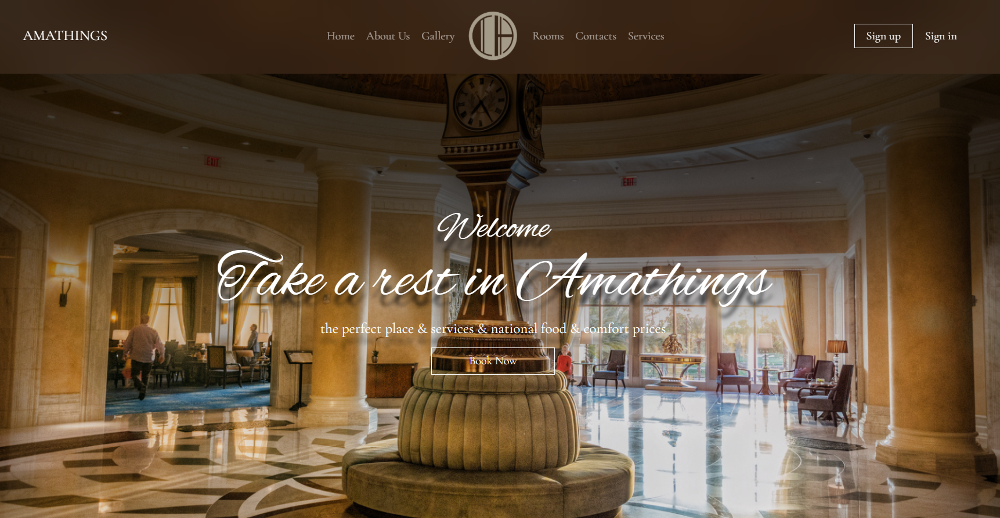
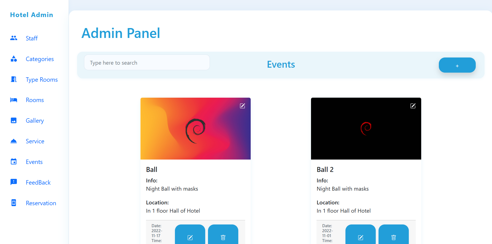

<h1 align="center">🏨 Hotelapp</h1>

  Система онлайн-бронирования отелей с <b>Backend (Django)</b>, <b>Frontend для клиентов</b> и <b>Админ-панелью</b>.

### Главная страница клиента

### Страница регистрации
![Панель клиента(screenshots/ui2.png)

### Панель администратора

## 📂 Структура проекта

Hotelapp/
├── hotel-reservation-main/ # Django backend (API, логика, модели)
├── hotel-reservation-client-main/ # Клиентская часть (React / Vue / JS)
├── hotel-reservation-admin-main/ # Админ-панель для персонала
└── .gitignore

## ⚡ Технологии

- 🐍 **Python / Django** — серверная часть, API, авторизация
- 🎨 **React / Vue (JS)** — интерфейсы для клиентов и админов
- 🗄 **SQLitе — база данных
- ⚙ **REST API** для связи фронта и бэка
- 🔑 JWT / Django Auth (если используется авторизация)

---

## 🚀 Запуск проекта

### 🔹 1. Backend (Django)
  cd hotel-reservation-main
  python -m venv venv
  venv\Scripts\activate   # Windows
  # или source venv/bin/activate  # Linux / macOS
  pip install -r requirements.txt
  python manage.py migrate
  python manage.py runserver
  ➡ Открой в браузере: http://127.0.0.1:8000/

🔹 2. Client (Frontend)
  cd ../hotel-reservation-client-main
  npm install
  npm start
🔹 3. Admin Panel
  cd ../hotel-reservation-admin-main
  npm install 
  npm start
📌 Основные возможности
  ✔ Регистрация и вход пользователей
  ✔ Просмотр доступных номеров и бронирование
  ✔ Управление бронированиями (CRUD)
  ✔ Панель администратора для управления:

🏨 номерами и отелями

👤 пользователями

📅 бронями

🖼 Скриншоты интерфейса
🔹 Клиентская часть

🔹 Админ-панель

🔹 Backend API (Django)

👨‍💻 Автор
Jasur
